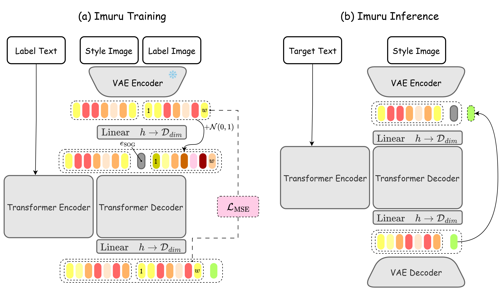

# Imuru: Style-Image-Only Autoregressive Handwritten Text Generation


## Introduction

**Imuru** is an offline handwritten text generation (HTG) model that synthesizes images of **user-specified text** in the **handwriting style of a reference image**.  

The code is tested on Python 3.11.13, CUDA 12.8, and PyTorch 2.7.1 using a NVIDIA RTX Pro 6000 Blackwelll GPU.

View **Paper**, **Models**, and the **Demo** below:

[](./assets/Imuru.pdf)

](https://huggingface.co/Ruian7P/imuru_large)

](https://huggingface.co/Ruian7P/imuru_small)

](https://huggingface.co/spaces/Ruian7P/imuru)


<p align="center">
  
</p>
<p align="center">
   Overview of the proposed Imuru.
</p>


## Installation
Install the required Python packages to train the model:
```console
conda create --name imuru python=3.11.13
conda activate imuru
pip install -r requirements.txt
```


## Training

Our model is composed of a Variational Autoencoder and a T5 Transformer. For training the VAE, please refer to the repositories of [Emuru](https://github.com/aimagelab/Emuru-autoregressive-text-img)

### Train Imuru (based on T5)

You can edit the parameters in scripts, and run:

```console
bash scripts/train_t5.sh
```

with parameters:

| Parameter                | Default | Description                                                  |
| :----------------------- | :------ | :----------------------------------------------------------- |
| **`--epochs`**           | `10000` | The total number of training epochs.                         |
| **`--lr`**               | `1e-4`  | The initial learning rate.                                   |
| **`--train_batch_size`** | `2`     | The batch size for the training dataset.                     |
| **`--eval_batch_size`**  | `8`     | The batch size for the evaluation dataset.                   |
| **`--max_width`**        | `None`  | The max width for training samples                           |
| **`--mixed_precision`**  | `no`    | Whether to use mixed precision training. Options: `no`, `fp16`, `bf16`. |
| **`--style_enc`**        | `full`  | Imuru initialization strategies. Use full for best performance |
| **`--label_noise`**      | `0.0`   | Amount of noise added to label during teacher-forcing.       |
| **`--style_noise`**      | `0.0`   | Amount of noise added to style                               |


## Evaluation
We compare **Imuru** with several state-of-the-art generative models, including [DiffusionPen](https://github.com/koninik/DiffusionPen), [One-DM](https://github.com/dailenson/One-DM),  [VATr++](https://github.com/EDM-Research/VATr-pp), [VATr](https://github.com/aimagelab/VATr), [HiGANplus](https://github.com/ganji15/HiGANplus), and [Emuru](https://github.com/aimagelab/Emuru-autoregressive-text-img)
We use the library [HWD](https://github.com/aimagelab/HWD) for evaluation.


## Inference
You can use our [demo](https://huggingface.co/spaces/Ruian7P/imuru) for faster application, or run:

```
python inference.py --model_path "Ruian7P/imuru_large" --target_text "Never gonna make you cry" --save_path "your_path" --img_path "dataset/sample.png"
```


## Acknowledgement

We greatly appreciate the contributions of two remarkable repository: [Emuru](https://github.com/aimagelab/Emuru-autoregressive-text-img) and [HWD](https://github.com/aimagelab/HWD). These projects have significantly benefited our work.